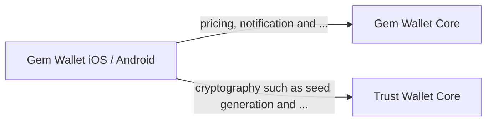

# Gem Core Library

The Gem Core library is a Rust monorepo that serves as the backend infrastructure and cross platform libraries for the Gem Wallet on Android and iOS. It handles various tasks, including:

- Push notifications
- Pricing information
- Asset updating
- Shared modes using TypeShare
- Crypto primitives
- More

## Gemstone

The Gemstone is a cross-platform library for Swift and Kotlin.

## Cryptography

The underlying cryptography / keystore for Gem Wallet is implemented using [Trust Wallet Core](https://github.com/trustwallet/wallet-core) for now.

> Note: According to the roadmap, in the future, the client will only interact with the Gem Wallet Core, and the interaction with the Trust Wallet Core will be the responsibility of the Gem Wallet Core.

## Running

### Setup Core

Run `make install` to install rust, typeshare

### Setup DB

- Create a new database `api` and grant privileges to `username` role
- Run `diesel migration run` to create tables and do migrations

### Supported Chains

| Chain        | Transfers     | Token Transfers |
|--------------|---------------|-----------------|
| Bitcoin      | ✅            | --              |
| Litecoin     | ✅            | --              |
| Doge         | ✅            | --              |
| Ethereum     | ✅            | ✅               |
| SmartChain   | ✅            | ✅               |
| Solana       | ✅            | ✅               |
| Polygon      | ✅            | ✅               |
| Thorchain    | ✅            | 🏗               |
| Cosmos       | ✅            | 🏗               |
| Osmosis      | ✅            | 🏗               |
| Arbitrum     | ✅            | ✅               |
| Ton          | ✅            | 🏗               |
| Tron         | ✅            | ✅               |
| Optimism     | ✅            | ✅               |
| Aptos        | ✅            | 🏗               |
| Base         | ✅            | ✅               |
| AvalancheC   | ✅            | ✅               |
| Sui          | ✅            | 🏗               |
| Xrp          | ✅            | 🏗               |
| OpBNB        | ✅            | ✅               |

List of available chains specified in [primitives package](https://github.com/gemwalletcom/core/blob/main/primitives/src/chain.rs).
